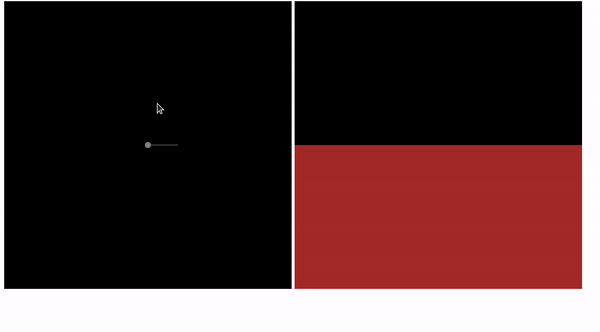

# raycasting-engine
A little raycasting engine made by someone who sucks in maths

## History

I had wanted to do raycasting for a long time. The problem is, I'm not good at math. 
I understood the principle of raycasting but the examples I found on the internet used too many obscure calculations that I had trouble understanding. 
So, I made something with my basic knowledge in maths, and finally it works pretty well. 

## How it works

I setup two canvases. One to observe the movements of the camera "seen from the sky", and another to display the rays projected on the obstacles.

You must use the keys Z S Q and D to move the camera.
To add obstacles, use the mouse on the left canvas. Simply left-click to define the first point of the obstacle, 
hold the click and move the mouse on the canvas to define the second point of the obstacle, then release the left click. Then an obstacle will be drawn on the scene. 

## render

